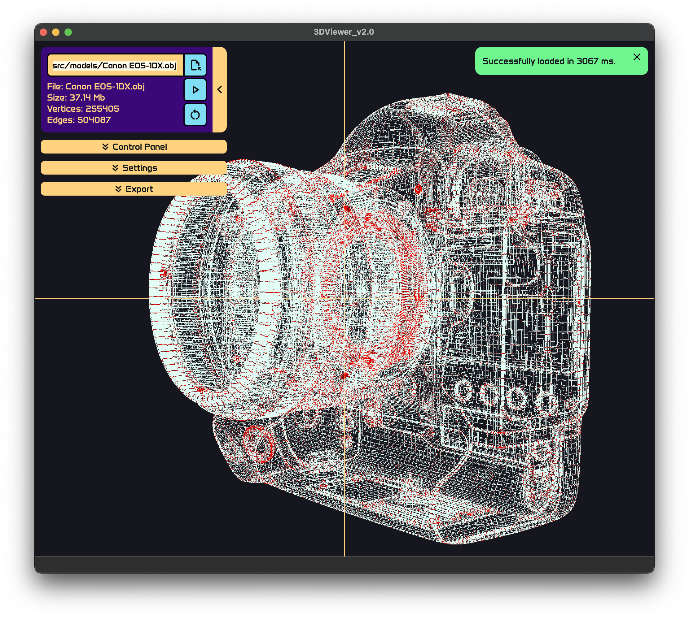

# 3DViewer v2.0

## Preview

The program is an implementation of Wavefront .obj 3d model viewer, created for educational purpose. The application allows user to view skeleton carcass of a model and only shows vertices and edges. It has set of different customization options. \
Modules, file parser and affine transitions specifically, were written on C++ language (except 3rd party qtgifimage library written in C), UI elements were constructed using C++ QT framework and used 3D rendering with OpenGL.

## Content

1. [Install](#install)
2. [Uninstall](#uninstall)
3. [Misc](#misc)
4. [Description](#description)
5. [Authors](#authors)

## Install

Make sure you have gcc (or clang), make, qmake and QT of version 5 or more installed. \
All `make` command are supposed to be performed in `src` directory.

To install application use `make install` command. \
The application will be located in `src/3DViewer_v2.0` of the project. \
Use `make run` to run. \
There will be pack of object models in `src/3DViewer_v2.0/models/` after installation.

## Uninstall

To uninstall application use `make uninstall` command.
For reinstalling `make reinstall`.

## Misc

- `make clean` - clear all files created during installation or else.
- `make dist` - create distribution archive `.tar` with all content.
- `make distclean` - delete created distribution archive.
- `make dvi` - open README.md.
- `make test` - perform tests for modules. It uses `gtest` library and `cmake` for building.
- `make gcov_report` - perform tests and create code analysis report. It uses `lcov` utility.
- `make style` - check for codestyle.
- `make memtest` - use memcheck utility to analyze for leaks with tests. Uses `valgrind` or `leaks` depending on OS.
- `make memtest_app` - use memcheck utility to analyze for leaks with running app.

## Description

### Start

1. Press `Open` button and find `.obj` file to view. Path will be shown in the text field.
2. Press `Start` button to perform file into view mode. `Reset` button resets position and scale to the default.

### Control

1. The panel holds three dimensional - translation by one axis, rotation around axis and scaling. Scaling has limits of motion (apprx 0.04 ~ 40000 units).
2. View area is limited by on Z axis (camera position or point of view is always placed on Z axis). Though it has option for auto adjusting camera on Z axis (see `Settings`).
3. Scene can be rotated by mouse press-and-move action, and rescaled by mouse wheel revolution.

### Settings

1. Settings deliver customization options:

- Colors of dots, lines and background.
- Size of dots, width of lines.
- Perspective or parallel projection (slider below changes focus depth of perspective projection, `fish-eye` alike).
- Circle, square or none appearance of dots.
- Show axis.
- Solid or dotted line type. There are 8 patterns of dotted line.
- Auto adjust Z (Move camera alongside Z axis). NOTE: if active, allows camera to follow model motion on Z axis, thus there is no possibility for model to run out of our sight.

2. Settings will be saved on exit. Use `Save` and `Load` button to save and load settings in runtime. To drop settings to the default press `Default` button.

### Export

1. The application supports exporting images in `JPEG`, `BMP` formats.
2. Press `GIF` button to cut short animation scenes in GIF format (5 seconds, 10 fps), window resolution if `HD` is on, 640x480 otherwise.
