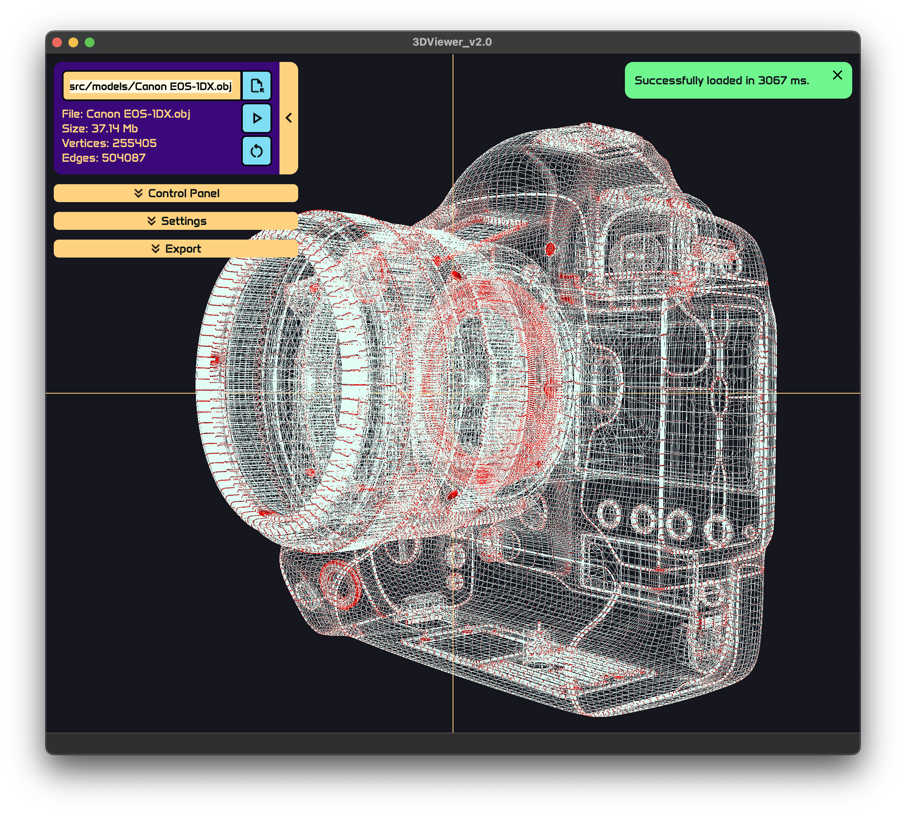
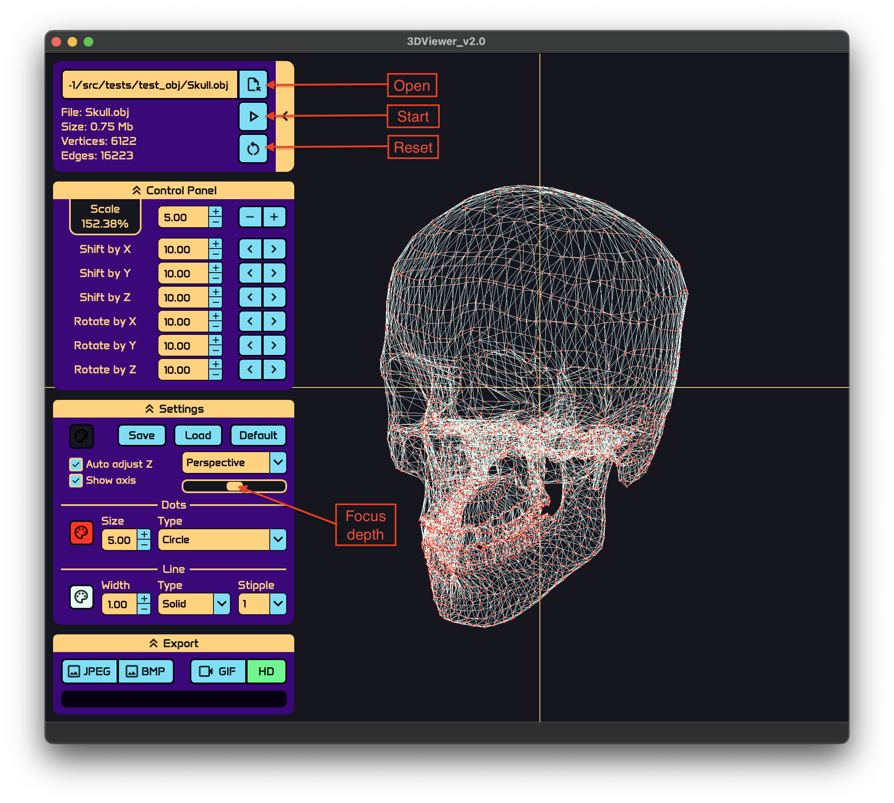

# ТриДэПросмотрщик в2.0

## Введение

Программа представляет из себя просмотрщик 3д моделей файлов .obj формата. Приложение написано в рамках образовательного курса Школы 21. Программа позволяет просматривать каркас моделей и показывает только вершины и грани фигур. \
Модули, такие как парсер файла и аффинные преобразования, написаны на языке C++ (за исключением GIF библиотеки `qtgifimage`), графическая оболочка была собрана с помощью QT, а отрисовка 3Д изображения происходит через OpenGl.

## Содержание

1. [Установка](#установка)
2. [Удаление](#удаление)
3. [Дополнительно](#дополнительно)
4. [Описание](#описание)
5. [Создатели](#создатели)

## Установка

Для установки программы необходимо иметь gcc (or clang), make, qmake, QT версии 5 или выше предустановленными в системе. \
Все `make` команды должны выполняться в `src` директории.

Для установки приложения используйте команду `make install`. \
Установленное приложение будет находиться в папке `src/3DViewer_v2.0` проекта. \
Для запуска используйте команду `make run`. \
В папке приложения также будут находиться некоторые примеры объектов `src/3DViewer_v2.0/models/`.

## Удаление

Для удаления используйте команду `make uninstall`.
Для переустановки есть команда `make reinstall`.

## Дополнительно

- `make clean` - очищает все файлы созданные во время компиляции.
- `make dist` - создает архив `.tar`, содержащий все необходимые файлы для установки.
- `make distclean` - удаляет созданный архив.
- `make dvi` - открывает инструкцию.
- `make test` - выполняет интеграционные тесты для модулей. Использует библиотеку `gtest`, собирается через `cmake`.
- `make gcov_report` - запускает тесты и формирует отчет о покрытии кода. Использует утилиту `lcov`.
- `make style` - проверяет стиль кода на соответствие Google.
- `make memtest` - проверяет программу на утечки памяти запуская тесты. Использует `valgrind` или `leaks` утилиты в зависимости от ОС.
- `make memtest_app` - проверяет программу на утечки памяти запуская приложение.

## Описание

### Начало

1. Нажать кнопку `Open`, найти файл `.obj`. Путь будет указан в текстовом поле.
2. Нажать `Start` чтобы просмотреть модель. Кнопка `Reset` сбрасывает позицию и масштаб до изначальных.

### Управление

1. Панель управления позволяет двигать модель по трем осям - сдвиг по оси, вращение вокруг оси и масштабирование. У маштабирования есть нижний и верхний предел.
2. Область видимости по оси Z тоже ограничена (камера всегда находится на оси Z). В настройках можно включить авто следование камеры таким образом, что весь объект находится в поле зрения (см. `Настройки`).
3. Объект можно вращать движением мыши с зажатой левой кнопкой, а также изменить масштаб вращением колеса мыши.

### Настройки

1. Настройки предоставляют возможность выбрать:

- Цвет вершин, линий и фона.
- Размер вершин и ширина линий.
- Тип проекции - центральная или параллельная. Слайдер снизу смещает фокус центральной проекции, схож с эффектом `Рыбий глаз`.
- Тип вершин - круг, квадрат или отсутствует.
- Показать оси.
- Тип линий - сплошные или пунктирные. Имеется 8 типов пунктирных линий.
- `Auto adjust Z`. Передвигать камеру по оси Z. ВАЖНО: если активно, позволяет камере следовать за движением модели по оси Z,таким образом не допуская ситуации выхода модели из области видимости.

2. Настройки сохраняются между запусками приложения. Кнопки `Save` и `Load` позволяют сохранить и загрузить состояние настроек в процессе работы приложения. Кнопка `Default` используется для сброса настроек по умолчанию.

### Экспорт

1. Приложение поддерживает экспорт изображений в `JPEG`, `BMP` форматах. \
2. Также программа может обрезать небольшие скрин-касты в GIF формате (5 seconds, 10 fps) с оконным разрешением если кнопка `HD` активна, иначе 640x480.